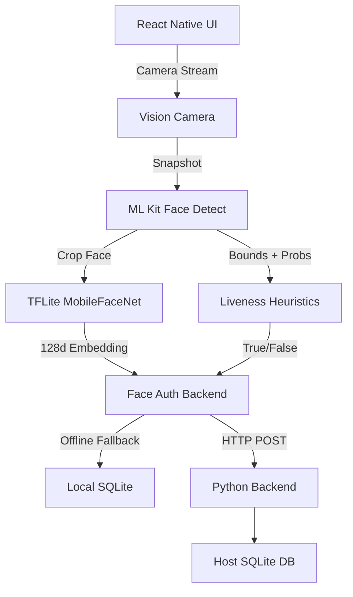

# Codebase Knowledge Base

## 1. Executive Summary
- **Project Purpose**: Build an offline-first facial recognition and liveness detection mobile application for iOS/Android using React Native.
- **Problem Being Solved**: Secure attendance and identity verification in environments with poor or no internet connectivity.
- **Overall Architecture**: A domain-driven React Native mobile client executing ML Kit face detection and heuristic liveness checks. A Python backend handles storage and similarity computations via SQLite. An offline PyTorch ML system (`offline-face-auth`) exists but is currently disconnected.
- **Current Implementation Status**: Phase 3 is complete. Face detection, liveness heuristics (blink, smile, turn head), and an automated verification UI flow are built. Face embeddings are currently *mocked* using mathematical wave functions rather than a true neural network.
- **Major Subsystems**: 
  - **Frontend Client**: React Native CLI, Vision Camera, ML Kit, Zustand state management.
  - **Python Backend**: Zero-dependency Python HTTP server (`backend/server.py`) with SQLite.
  - **ML Subsystem**: PyTorch MobileFaceNet implementation (`offline-face-auth`), standalone and disconnected.

---

## 2. Repository Structure
```
HACKATHON-7.0-Face-Detection-/
├── frontend/             # React Native Mobile Application
│   ├── src/              # Source Code
│   │   ├── components/   # Reusable UI elements (CameraOverlay, LivenessOverlay)
│   │   ├── config/       # Environment configs (env.ts)
│   │   ├── core/         # Core business logic (ML, Store, Liveness, Backend APIs)
│   │   ├── hooks/        # React hooks (useCameraSetup, useFaceDetection, useLiveness)
│   │   ├── navigation/   # React Navigation stacks
│   │   ├── screens/      # Full-page components (CameraScreen)
│   │   └── types/        # TypeScript interfaces
│   ├── android/          # Native Android build configuration
│   └── ios/              # Native iOS build configuration
├── backend/              # Python Backend
│   ├── db/               # SQLite database directory
│   └── server.py         # Main HTTP API Server
└── offline-face-auth/    # Offline ML Pipeline (Currently Disconnected)
    ├── models/           # Stored PyTorch weights
    ├── mobilefacenet.py  # MobileFaceNet Neural Network Architecture
    ├── recognize.py      # Embedding extraction wrapper
    ├── liveness.py       # Standalone MediaPipe liveness testing
    └── verify.py         # Face verification loop
```

---

## 3. Frontend Analysis

### `src/components/camera/CameraOverlay.tsx` & `LivenessOverlay.tsx`
- **Purpose**: Render bounding boxes, user instructions, and challenge progress over the live camera feed.
- **Dependencies**: React Native Animated API, Zustand store.
- **Business Logic**: Purely presentational. Subscribes to `useAppStore` for coordinates.

### `src/hooks/useFaceDetection.ts`
- **Purpose**: Handles the camera frame loop. Grabs snapshots at ~8fps, feeds them to ML Kit.
- **Business Logic**: Maps ML Kit pixel coordinates to React Native screen dimensions. Pushes generated liveness properties (smile probability, eye open probability, yaw) into the Zustand rolling buffer.

### `src/hooks/useLiveness.ts`
- **Purpose**: A React Hook that acts as the state machine for the verification challenge. 
- **Business Logic**: Transitions from `idle` -> `waiting_for_face` -> `face_stable` -> `challenge_active`. Evaluates challenges via `evaluateChallenge()` and manages timeouts.

### `src/core/ml/embeddingAdapter.ts`
- **Purpose**: **CRITICAL** - Generates the face embedding.
- **Business Logic**: Currently generates a *mock* 128-d normalized vector using a sine/cosine wave based on the bounding box coordinates and liveness signals. This is a placeholder for Phase 4.

### `src/core/backend/faceAuthBackend.ts`
- **Purpose**: Acts as the API client to the Python backend.
- **Business Logic**: Sends HTTP POST requests to `/enroll` and `/verify`. Crucially, if the backend is unreachable (offline mode), it falls back to `localDatabase.ts`.

### `src/core/backend/localDatabase.ts`
- **Purpose**: Provides offline state storage.
- **Business Logic**: Currently an in-memory JS object (`db.users`, `db.embeddings`). Handles cosine similarity calculations when the remote backend is offline.
- **Future**: Must be replaced with `react-native-quick-sqlite`.

---

## 4. React Native Architecture
- **State Management**: Uses Zustand (`useAppStore.ts`). 
  - To prevent React 19 infinite loops, Zustand selectors are strictly scalar (never returning objects).
  - Liveness frames are kept in a fixed-size (max 15) rolling buffer array to avoid memory leaks.
- **Camera Pipeline**: Continuous 30fps preview -> `setInterval` snapshot taken via Nitro Image every 125ms -> Saved to `/tmp` as 40% JPEG -> Processed by ML Kit.
- **Liveness Flow**: The liveness store acts reactively based on `useEffect` observing the `livenessFrameBuffer`. 

---

## 5. Backend Analysis

### `backend/server.py`
- **Responsibility**: Lightweight HTTP REST API handling face authentication.
- **Database Interactions**: Direct execution of SQLite queries.
- **API Contracts**: 
  - `POST /enroll`: Accepts `{ name, embedding }`, returns `{ user, saved }`.
  - `POST /verify`: Accepts `{ embedding, livenessPassed, deviceId }`, returns `{ status, confidence, user }`.
- **Security**: Embeddings are stored as raw JSON strings (placeholder for encryption). No HTTPS/TLS implemented. 

---

## 6. Database Analysis
**Schema** (from `server.py`):
- `users`: `id` (PK), `name`, `created_at`.
- `embeddings`: `user_id`, `embedding` (JSON array), `encrypted` (int).
- `auth_events`: `id`, `user_id`, `confidence`, `liveness_passed`, `device_id`, `timestamp`, `status`, `synced`.
- `sync_queue`: `id`, `payload`, `status`, `created_at`.
**Storage Strategy**: Synchronous SQLite. Embeddings are stored entirely in RAM during verification `SELECT * FROM embeddings` and compared line-by-line via Python's math module.

---

## 7. Security Analysis
- **Encryption Strategy**: Table schema mentions `encrypted=1`, but data is inserted as plain JSON.
- **Authentication Design**: Relies entirely on the Face Embedding cosine similarity threshold (`>0.6`) and the frontend's claim that `livenessPassed=true`. The backend blindly trusts the frontend's liveness check.
- **Privacy Considerations**: Face images are *never* transmitted to the backend. Only the mathematical embedding vector leaves the device.

---

## 8. ML System Analysis (`offline-face-auth`)
**Status**: Completely disconnected from the actual application.
- `mobilefacenet.py`: Defines the PyTorch Neural Network architecture (Depthwise Separable Convolutions, Inverted Residuals).
- `recognize.py`: Loads `mobilefacenet.pt`. Implements `preprocess()` (resize to 112x112, BGR->RGB, normalization to [-1, 1]). Exposes `get_embedding(face)`.
- `detector.py`: Uses legacy `cv2.CascadeClassifier` (Haar Cascades) to crop faces.
- `enroll.py`: Captures 5 webcam frames, extracts the face, gets 5 embeddings, averages them, and saves a `.npy` file.
- `verify.py`: Real-time OpenCV loop computing Cosine Similarity against `.npy` files.

---

## 9. Model Analysis
- **Architecture**: MobileFaceNet. Optimized for mobile devices using depthwise separable convolutions (similar to MobileNetV2) but tailored for facial verification.
- **Inputs**: 112x112 RGB image tensor, normalized to `[-1, 1]`.
- **Outputs**: 128-dimensional normalized embedding vector.
- **Current Format**: PyTorch `.pt`. 
- **Integration Block**: React Native cannot natively run `.pt` files. The model must be converted to TFLite (`.tflite`) to be consumed by the frontend.

---

## 10. Enrollment Pipeline (Current vs Future)
**Current (Mocked)**:
1. User enters name.
2. Camera sees face -> ML Kit triggers `face_detected`.
3. Frontend mathematically generates fake 128-d vector from coordinates.
4. Sent to Backend -> Saved to SQLite.
**Future (Required)**:
1. Camera sees face -> Extract bounding box crop.
2. Resize crop to 112x112 -> Pass to TFLite MobileFaceNet.
3. Obtain true 128-d vector -> Send to Backend.

---

## 11. Recognition Pipeline (Current)
1. Camera snapshot taken every 125ms.
2. ML Kit finds bounding box.
3. Liveness heuristic evaluates to `true`.
4. `embeddingAdapter.ts` mocks embedding.
5. Sent to Backend `/verify`.
6. Backend runs `cosine_similarity(input, db_rows)`.
7. Best match > `0.6` threshold wins.

---

## 12. Liveness Pipeline
Reverse-Engineered from `src/core/liveness/livenessHeuristics.ts`:
- **State Machine**: Evaluated over a rolling 15-frame buffer.
- **Blink**: Looks for sequence: Both eyes `prob < 0.3` -> Both eyes `prob > 0.6` within 600ms.
- **Turn Head**: Estimates baseline yaw from recent frontal frames (`|yaw| < 20`). Checks if current yaw deviates by > `8°` from baseline. This approach makes it immune to OEM camera mirroring bugs.
- **Smile**: Smile `prob > 0.72` for 3 consecutive frames.

---

## 13. Current Integration Status
- **Frontend ↔ Backend**: FULLY INTEGRATED over HTTP APIs.
- **Frontend ↔ ML System**: COMPLETELY ISOLATED.
- **Backend ↔ ML System**: COMPLETELY ISOLATED.

---

## 14. Integration Gap Analysis
**Frontend ↔ ML Requirements**:
- **Missing**: A React Native wrapper to execute the TFLite inference.
- **Missing**: An automated script to convert `models/mobilefacenet.pt` to `mobilefacenet.tflite`.
- **Missing**: Image cropping utility in React Native to crop the ML Kit bounding box out of the full frame before passing it to TFLite.

---

## 15. API & Interface Requirements
**Frontend -> TFLite ML Interface (Proposed)**:
```typescript
interface MLInferenceEngine {
  loadModel(path: string): Promise<void>;
  getFaceEmbedding(imageUri: string, bounds: BoundingBox): Promise<number[]>;
}
```
**Frontend -> Backend (Current Contract - Stable)**:
```json
// POST /verify
{
  "embedding": [0.12, -0.45, ... 128 values],
  "livenessPassed": true,
  "deviceId": "local-device"
}
```

---

## 16. Data Flow Mapping
**Liveness Flow**:
`Camera Feed` -> `takeSnapshot` -> `MLKit(classification='all')` -> `{leftEyeProb, rightEyeProb, yaw}` -> `livenessFrameBuffer` -> `detectBlink()` / `detectHeadTurn()` -> `challengePassed`.

**Recognition Flow**:
`challengePassed=true` -> `createEmbeddingFromDetectionSignal(mock)` -> `faceAuthBackend.ts` -> `HTTP POST` -> `server.py` -> `SQLite SELECT` -> `cosine()` -> `Response`.

---

## 17. Technical Debt & Risks
- **Performance**: Taking a disk snapshot (`takeSnapshot`) every 125ms is heavy and generates `/tmp` clutter. A Vision Camera *Frame Processor Worklet* should ideally be used.
- **Security Risk**: The backend implicitly trusts `livenessPassed: true` from the client. A compromised client can bypass liveness.
- **Scale Risk**: Backend computes cosine similarity by fetching *all* embeddings into Python memory. Will crash with >10,000 users.
- **State Persistence Risk**: `localDatabase.ts` stores offline data in JS memory, meaning data is lost if the app closes.

---

## 18. Integration Roadmap
- **Phase 1 (Immediate)**: Replace in-memory `localDatabase.ts` with `react-native-quick-sqlite`.
- **Phase 2 (ML Prep)**: Write a python script to export `mobilefacenet.pt` to `mobilefacenet.tflite`.
- **Phase 3 (Recognition)**: Implement React Native TFLite engine (e.g. `react-native-fast-tflite`). Replace `embeddingAdapter.ts` mock with actual inference.
- **Phase 4 (Security)**: Implement backend encryption for SQLite payload data.
- **Phase 5 (Optimization)**: Migrate from 125ms polling snapshots to Vision Camera Frame Processors via C++ JSI.

---

## 19. Final System Architecture


---

## 20. Appendices
**Dependency Inventory**:
- `react-native-vision-camera`: v5.0.10
- `@react-native-ml-kit/face-detection`: v2.0.1
- `zustand`: v5.0.13
- `torch`: Required for disconnected offline-face-auth only.
